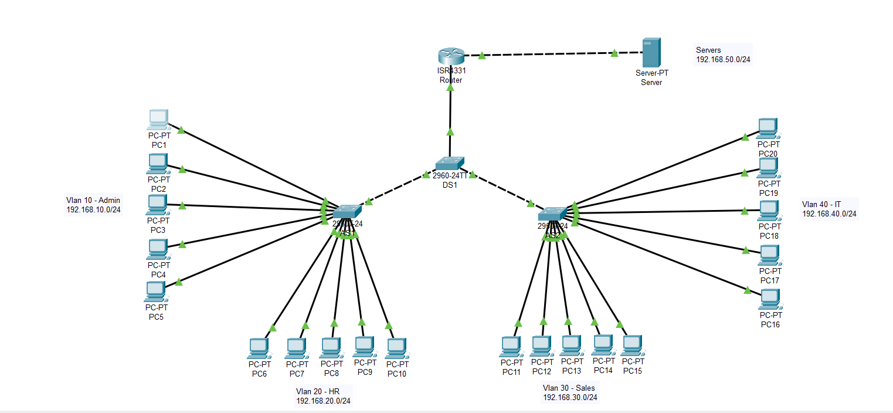

# Small-Office-Networking-Lab

## Overview
This project simulates a small office enterprise network designed and implemented using Cisco Packet Tracer. The lab focuses on core CCNA routing, switching, and IP services concepts, including VLAN segmentation, inter-VLAN routing, and centralized DHCP.

## Network Topology
The simulated office network consists of:
* One router performing Router-on-a-Stick for inter-VLAN routing
* One distribution switch
* Two access switches
* Multiple end-user PCs across departmental VLANs
* A centralized DHCP server connected directly to the router on a routed subnet

  

## VLAN and IP Addressing Scheme
| VLAN ID | Department | Subnet | Default Gateway |
| --- | --- | --- | --- |
| 10 | Admin | 192.168.10.0 | 192.168.10.1 |
| 20 | HR | 192.168.20.0 | 192.168.20.1 |
| 30 | Sales | 192.168.30.0 | 192.168.30.1 |
| 40 | IT | 192.168.40.0 | 192.168.40.1 |

### Server Network (Routed Interface)
* Subnet: 192.168.50.0
* Router Interface: 192.168.50.1
* DHCP Server: 192.168.50.2
  
## Technologies and Concepts Implemented
* VLAN creation and segmentation
* 802.1Q trunking between switches and router
* Router-on-a-Stick (inter-VLAN routing)
* Centralized DHCP Server
* DHCP relay using `ip helper-address`

## DHCP Design
The centralized DHCP server provides IP addressing for all user VLANs. Because the DHCP server resides on a separate routed subnet, DHCP requests are forwarded using DHCP relay (ip helper-address) configured on each router sub-interface.

## Repository Structure
```
small-office-network-lab/
│
├── README.md
├── topology/
│   └── Small_Office_Network.png
├── configs/
│   ├── router_config.txt
│   ├── switch_DS1.txt
│   ├── switch_AS1.txt
│   └── switch_AS2.txt
└── packet-tracer/
    └── Small_Office_Lab.pkt
```

## Testing and Verification
The following were verified in the lab:
* End devices reeive IP addresses from the correct DHCP scopes
* Devices can communicate within and across VLANs via the router
* DHCP relay functions correctly across routed subnets
* Default gateway and IP addressing operate as expected

## Future Enhancements
Planned improvements for this lab:
* Extended ACLs for inter-department access control
* Port security on access switch interfaces
* etc.

## Notes
*  Configuration files are exported running configurations from each device
*  This project is for learning, demonstration, and portfolio purposes
